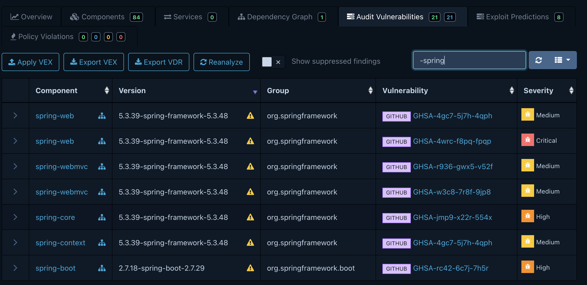

# Dependency-Track Component Analysis Platform

This section provides an overview on using [Dependency-Track](https://github.com/DependencyTrack/dependency-track), an OWASP project, to check for vulnerabilities in the Spring PetClinic application.

## Setup

For this tutorial, follow the [Getting Started guide](https://docs.dependencytrack.org/getting-started/distributions/) for installing Dependency-Track on your machine, OR log in [to this public Dependency-Track instance](https://dt-ui.quebec.ovh/projects), using `viewer` as the username and `viewer` as the password

> [!NOTE]
> The instructions in this document are for use with Dependency-Track version 4.13.4 or greater. Command line arguments might be different for older versions.


## Scanning the SBOM Without Exclusions

To scan the SBOM for vulnerabilities, run the following commands:

```bash
curl -X "POST" "https://dt-api.quebec.ovh/api/v1/bom" \
     -H 'Content-Type: multipart/form-data' \
     -H "X-Api-Key: odt_XXX" \
     -F "autoCreate=true" \
     -F "projectName=OSS-Petclinic" \
     -F "projectVersion=boot-2.7" \
     -F "bom=@oss-petclinic.sbom.cdx.json"

curl -X "POST" "https://dt-api.quebec.ovh/api/v1/bom" \
     -H 'Content-Type: multipart/form-data' \
     -H "X-Api-Key: odt_XXX" \
     -F "autoCreate=true" \
     -F "projectName=NES-Petclinic" \
     -F "projectVersion=boot-2.7" \
     -F "bom=@nes-petclinic.sbom.cdx.json"

```

> [!NOTE]
> There are other ways to submit the SBOMs, to an existing project for example, please refer to [the official documentation](https://docs.dependencytrack.org/usage/cicd/).

The results produced in those created projects:

* [OSS Petclinic 2.7](https://dt-ui.quebec.ovh/projects/f75c53bc-e19d-4fa1-9b10-ccfc541fa142)
* [NES Petclinic 2.7](https://dt-ui.quebec.ovh/projects/d4ead0a7-8a6c-4b7c-a1b4-ee2e5ef812b0)


will show all vulnerabilities that Dependency-Track identifies. 

Dependency-Track does not inherently recognize HeroDevs packages, so some CVEs that have been remediated are mistakenly included in the results. 

> [!NOTE]
> Dependency-Track can be configured with a number of Analyzers, on this [instance](https://dt-ui.quebec.ovh/), `Internal` and `Sonatype OSS Index` are configured and used.


> [!NOTE]
> Dependency-Track can be configured with a number of Vulnerability Sources, on this [instance](https://dt-ui.quebec.ovh/), `NVD`, `Github SA` and `Google OSV` are configured and used.


## Scanning the SBOM With Vex Statements

With Dependency-Track, it's possible to triage the vulnerabilities and export the findings to a [CycloneDX compatible format](https://cyclonedx.org/capabilities/vex/).

Using Dependency-Track UI, we can triage all the false positive NES artifacts for the [NES Petclinic 2.7 project](https://dt-ui.quebec.ovh/projects/d4ead0a7-8a6c-4b7c-a1b4-ee2e5ef812b0/findings), searching for `-spring` versioned artifacts (peculiar to NES Spring artifacts)


The UI makes it easy to mark the NES artifacts as false positive


Then you just export the VEX file


that you can re-import in any other Dependency Track project


You will notice that those triaged false positive are no longer counted nor shown, unless you switch to "Show suppressed findings" on.


> [!IMPORTANT]
> Only use the Vex files on HeroDevs NES for Spring SBOMs. The exclusions are not applicable to OSS versions.

With this updated report, we can compare [NES Petclinic 2.7](https://dt-ui.quebec.ovh/projects/d4ead0a7-8a6c-4b7c-a1b4-ee2e5ef812b0) to [OSS Petclinic 2.7](https://dt-ui.quebec.ovh/projects/f75c53bc-e19d-4fa1-9b10-ccfc541fa142) to see the vulnerabilities that have been remediated in the HeroDevs NES for Spring artifacts.
