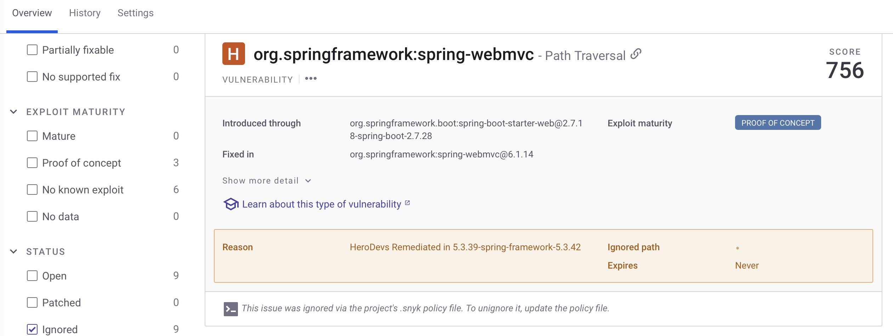

# Snyk Scanner

This section provides and overview on using the [Snyk scanner](https://snyk.io/) by Snyk.io to check for vulnerabilities in the Spring PetClinic application.

## Setup

For this tutorial, follow the [Getting Started with the Snyk CLI](https://docs.snyk.io/developer-tools/snyk-cli/getting-started-with-the-snyk-cli) for installing Snyk on your machine.
Check the version.

```bash
snyk --version
```

## Scanning the SBOM Without Exclusions

> [!NOTE]
> At the time of this writing, Snyk's current support (version 1.1299.0) of SBOM scanning is experimental.

To scan the SBOM for vulnerabilities, run the following commands:

```bash
snyk sbom test --experimental --file=../oss-petclinic.sbom.cdx.json --json | jq -r . > oss-petclinic-output.json
snyk sbom test --experimental --file=../nes-petclinic.sbom.cdx.json --json | jq -r . > nes-petclinic-unfiltered-output.json
```

> [!NOTE]
> The instructions in this document are for use with Snyk CLI version 1.1299.0 or greater. Command line arguments might be different for older versions.

The results produced above will show all vulnerabilities that Snyk CLI identifies. 
Snyk CLI does not inherently recognize HeroDevs packages, so some CVEs that have been remediated are mistakenly included in the output. 
These are false positives and should not be considered in the final security evaluation.

## Scanning the SBOM With Exclusions

Unfortunately, as of version 1.1299.0, `snyk sbom test` does not support exclusions.

If you use `snyk monitor` though, you can use a YAML policy file, named `.snyk` to ignore vulnerabilities that were fixed with NES.

If you run `snyk monitor` on https://github.com/neverendingsupport/nes-spring-petclinic/tree/nes-2.7.x after having copied `.snyk` to the root folder, you'll see that the Herodevs remediated issues are no longer counted as vulnerabilities



If using Snyk to monitor several projects, you will want to create organization-level policy files, as explained in the `[Snyk documentation](https://docs.snyk.io/manage-risk/policies/view-create-and-modify-policies)`.

> [!IMPORTANT]
> Only use the exclusion file on HeroDevs NES for Spring SBOMs. The exclusions are not applicable to OSS.