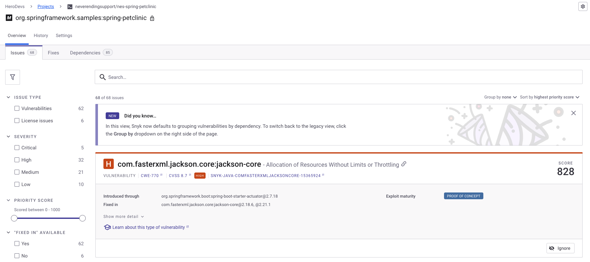
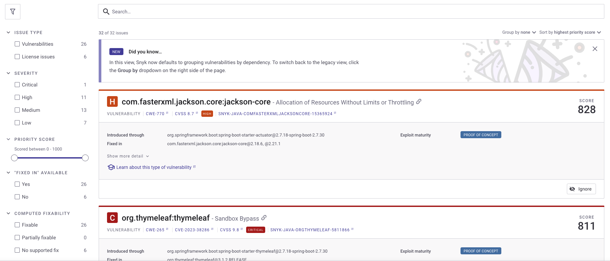
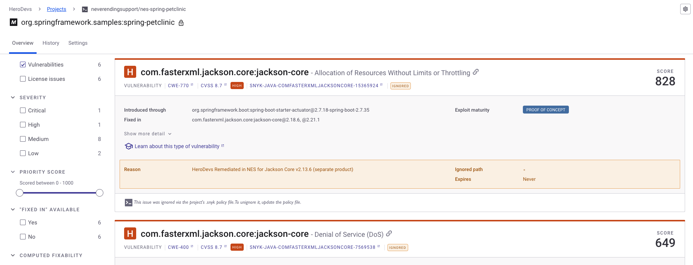

# Snyk

This page demonstrates how [Snyk](https://snyk.io/) reports vulnerabilities in [Spring PetClinic](https://github.com/spring-projects/spring-petclinic) — first using the final open-source Spring Boot 2.7.18 release, then using [HeroDevs Never Ending Support (NES) for Spring](https://www.herodevs.com/support/spring-nes) as a drop-in replacement. NES is a commercially supported continuation of end-of-life Spring artifacts that patches known CVEs without requiring a major version upgrade.

## Results at a Glance

| Severity | OSS (Spring Boot 2.7.18) | NES (unfiltered) | NES + `.snyk` policy |
|----------|--------------------------|-------------------|----------------------|
| Critical | 5  | 1  | 1  |
| High     | 33 | 10 | 0  |
| Medium   | 17 | 8  | 3  |
| Low      | 10 | 7  | 2  |
| **Total**| **65** | **26** | **6** |

Switching to NES reduces Snyk findings from 65 to 26 at the package level alone — a **60% reduction**. Applying the included `.snyk` policy file to suppress HeroDevs-remediated false positives brings the total down to **6 open findings**, a **91% reduction** from the OSS baseline.

The `.snyk` policy also covers CVEs remediated by separate HeroDevs NES products (NES for Jackson, NES for MySQL Connector/J, NES for SnakeYAML, NES for H2). The 6 remaining findings are from third-party dependencies not currently covered by a HeroDevs NES product (Thymeleaf, Logback).

## Prerequisites

Install the [Snyk CLI](https://docs.snyk.io/developer-tools/snyk-cli/getting-started-with-the-snyk-cli) and authenticate with your Snyk account.

```bash
snyk --version
```

> [!NOTE]
> The commands below require Snyk CLI version 1.1302.0 or later.

## Step 1 — Scan the OSS SBOM

Run the Snyk CLI against the open-source Spring Boot 2.7.18 CycloneDX SBOM:

```bash
snyk sbom test --file=oss-petclinic.sbom.cdx.json --json | jq . > oss-petclinic-output.json
```

**What to expect:** Snyk reports **65 vulnerabilities** — 5 critical, 33 high, 17 medium, and 10 low. These are real findings against the last publicly available Spring Boot 2.7.x release, which reached end-of-life in November 2023 and no longer receives security patches.



> [!NOTE]
> The dashboard totals differ slightly from the CLI output because the Snyk web UI includes license issues alongside vulnerabilities and may group findings differently by dependency. The vulnerability counts referenced throughout this document come from the CLI (`snyk sbom test`) for reproducibility.

The full output is saved in [`oss-petclinic-output.json`](oss-petclinic-output.json) for reference.

## Step 2 — Scan the NES SBOM

Now scan the CycloneDX SBOM built with HeroDevs NES for Spring:

```bash
snyk sbom test --file=nes-petclinic.sbom.cdx.json --json | jq . > nes-petclinic-unfiltered-output.json
```

**What to expect:** Snyk reports **26 vulnerabilities** — down from 65. HeroDevs NES patches Spring Framework and Spring Boot CVEs directly in the artifacts, so the majority of Spring-related findings are resolved without any scanner configuration.

However, Snyk does not natively recognize HeroDevs version identifiers (e.g., `5.3.39-spring-framework-5.3.48`), so some CVEs that HeroDevs has already remediated still appear in the results. These are false positives — the underlying code has been patched, but Snyk's version matching does not yet account for the NES versioning scheme.

The full output is saved in [`nes-petclinic-unfiltered-output.json`](nes-petclinic-unfiltered-output.json) for reference.

After importing with `snyk monitor`, the Snyk dashboard shows the reduced finding count — 32 issues with 1 critical, 11 high, 13 medium, and 7 low:



## Step 3 — Apply the `.snyk` Policy File

To clear the false positives from Step 2, use Snyk's [policy file](https://docs.snyk.io/manage-risk/policies/the-.snyk-file) (`.snyk`) to mark HeroDevs-remediated CVEs as ignored.

> [!NOTE]
> `snyk sbom test` detects the `.snyk` policy file but does not apply its ignore rules to the results. To suppress HeroDevs-remediated false positives, use `snyk monitor` to import results into the Snyk web dashboard, where the policy is enforced.

To apply the policy:

1. Create a [`.snyk`](.snyk) policy file in the root of your project. See the example in this directory for reference.
2. Run `snyk monitor` against your NES project source:

```bash
snyk monitor
```

The `.snyk` file documents each suppression with the specific HeroDevs release that remediated the CVE, so every ignore decision is traceable:

```yaml
# Example entry from .snyk
'SNYK-JAVA-ORGSPRINGFRAMEWORK-8230373':
  - '*':
      # CVE-2024-38819
      reason: 'HeroDevs Remediated in 5.3.39-spring-framework-5.3.42'
```

**What to expect:** In the Snyk dashboard, HeroDevs-remediated CVEs move to **Ignored** status. The reason field displays the exact HeroDevs release that addressed each vulnerability.



The dashboard now shows **6 open findings** and **20 ignored** — each ignore is documented with a clear audit trail.

## Step 4 — What Remains

The 6 open findings after applying the `.snyk` policy are from third-party dependencies not currently covered by a HeroDevs NES product:

| Package | Severity | Issue | Count |
|---------|----------|-------|-------|
| `thymeleaf` | Critical | Sandbox Bypass | 1 |
| `logback-core` | Medium | Improper Neutralization of Special Elements | 1 |
| `logback-core` | Medium | External Initialization of Trusted Variables or Data Stores | 1 |
| `logback-core` | Low | Server-side Request Forgery (SSRF) | 1 |
| `logback-core` | Low | External Initialization of Trusted Variables or Data Stores | 1 |
| `logback-classic` | Medium | Improper Neutralization of Special Elements | 1 |

These are genuine findings unrelated to Spring and should be evaluated independently. NES for Spring covers Spring Framework and Spring Boot artifacts — other dependencies follow their own upgrade paths.

## Scaling Across Projects

If your organization monitors multiple projects with Snyk, you can apply the same exclusion rules at the organization level using [Snyk organization policies](https://docs.snyk.io/manage-risk/policies/view-create-and-modify-policies) rather than copying `.snyk` into each project individually.

> [!IMPORTANT]
> Only apply the `.snyk` exclusion file to projects built with HeroDevs NES for Spring. The exclusions are specific to NES-remediated CVEs and should not be used with OSS Spring builds.
